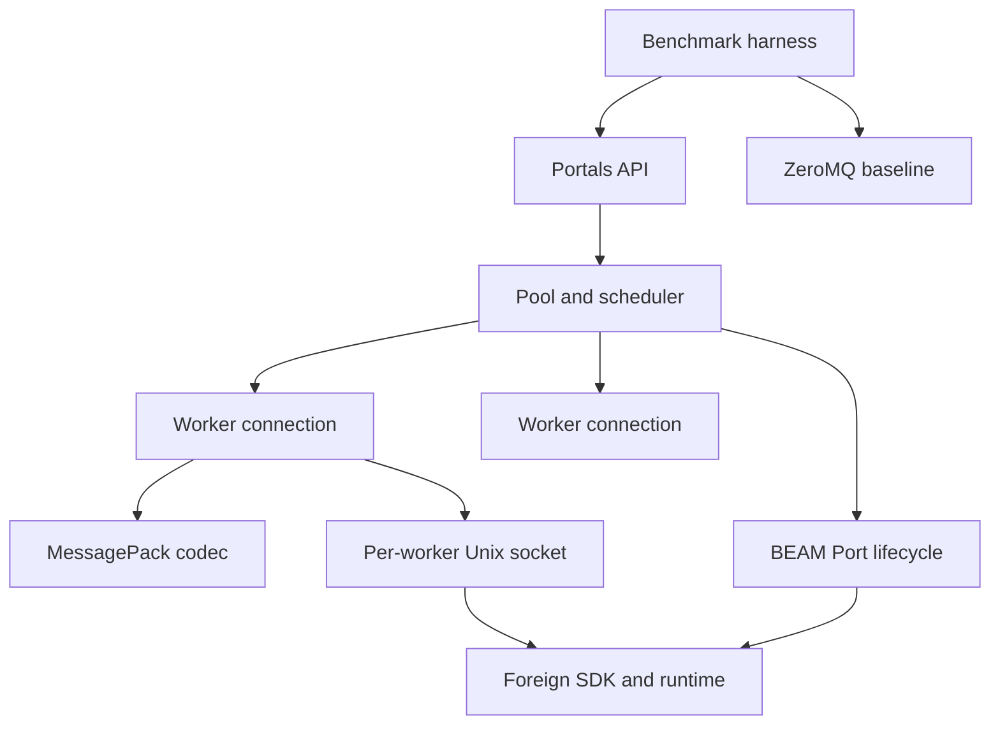
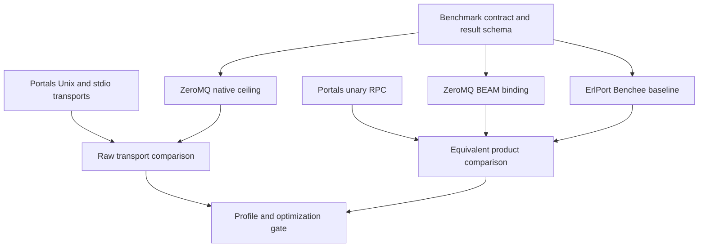
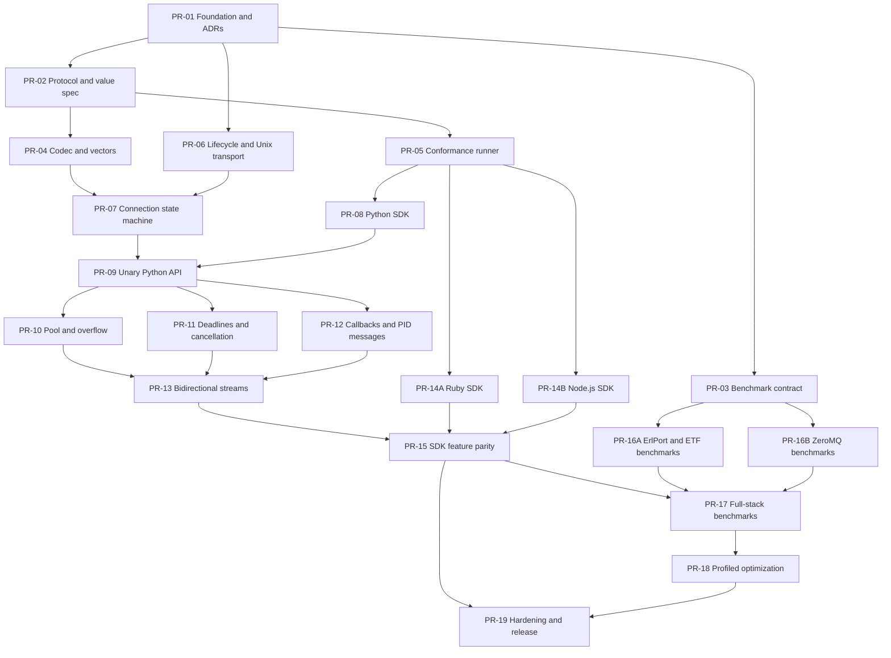

# Portals: Elixir Polyglot Runtime Bridge

**Status:** Revised decision-complete PRD  
**Working name:** Portals  
**Implementation language:** Elixir  
**Primary runtime:** BEAM / OTP  
**Default data transport:** One Unix-domain socket per worker  
**Worker lifecycle:** BEAM Port  
**Performance reference:** ZeroMQ  
**Replacement baseline:** original `hdima/erlport`  
**Elixir benchmark framework:** Benchee

## 1. Executive summary

Portals is an Elixir-first successor to ErlPort for invoking functions in trusted external programming-language runtimes while retaining OTP supervision, crash isolation, bounded backpressure, observability, callbacks, message delivery, and concurrency semantics.

The BEAM launches and monitors each worker through a BEAM Port, but RPC data uses one Unix-domain socket per worker by default. The BEAM creates and listens on the socket before launching the worker; the worker connects. Stdin/stdout framing is an automatic fallback only on platforms where Unix-domain sockets are unsupported. Linux is the only officially supported 1.0 platform.

The protocol uses MessagePack compact tagged arrays and production extensions for Erlang-specific values. Protocol compatibility is an exact-version match. ETF is implemented only as an internal benchmark codec, both as a full alternate Portals path and in isolated codec microbenchmarks; it is not a supported production codec.

Portals 1.0 targets behavioral—not source-level—compatibility with ErlPort through a new public API. It must include arbitrary module/function invocation, reverse BEAM callbacks, direct message delivery, and Erlang-value fidelity. Python, Ruby, and Node.js SDKs ship inside the Hex package as one synchronized monorepo release.

ZeroMQ is a regression reference rather than a release blocker. ErlPort is the replacement baseline; matching ErlPort performance is acceptable when Portals demonstrates materially better pooling, cancellation, supervision, bidirectional streaming, backpressure, telemetry, and health inspection.

## 2. Problem statement

ErlPort demonstrates that BEAM Ports can safely connect Erlang or Elixir to external runtimes, but it has several constraints:

- Only Python and Ruby are directly supported.
- Language adapters implement BEAM-specific ETF semantics.
- Worker lifecycle, protocol handling, and public APIs are tightly coupled.
- Cancellation, bounded concurrency, streaming backpressure, and structured capability negotiation are incomplete.
- Pending calls use legacy data structures and a linear request-ID allocation path.
- It is difficult to separate transport, serialization, and application overhead when benchmarking.

Elixir developers currently choose between narrowly scoped language integrations, general network RPC systems, native extensions that can compromise VM stability, or ad hoc Port protocols. Portals should provide a reusable middle ground.

## 3. Product vision

An Elixir developer should be able to supervise a pool of Python, Rust, Node.js, Go, JVM, or other workers as naturally as supervising BEAM processes:

```elixir
children = [
  {Portals.Pool,
   name: MyApp.Python,
   command: {"python3", ["priv/python_worker.py"]},
   size: 4,
   max_in_flight_per_worker: 16}
]

{:ok, value} =
  Portals.call(MyApp.Python, "embedding", "encode", [%{text: "hello"}],
    timeout: 5_000
  )
```

The foreign worker should need only a small SDK or protocol adapter:

```python
from portals import Worker

# The trusted worker imports the requested module and invokes the named function.
Worker().run()
```

## 4. Goals

### 4.1 Product goals

1. Replace ErlPort behavior for common and advanced Python/Ruby integration patterns through a new Portals API.
2. Make external language workers first-class OTP-supervised resources.
3. Make a basic new-language adapter independently implementable from the protocol and conformance suite.
4. Support synchronous, asynchronous, concurrent, callback, messaging, and bidirectional streaming calls.
5. Preserve BEAM stability when a worker crashes, hangs, emits malformed data, or exceeds resource limits.
6. Provide explicit execution deadlines, cooperative cancellation, checkout timeouts, overflow limits, and backpressure.
7. Make transport, codec, dispatch, and application overhead independently measurable.
8. Match or exceed ErlPort performance while exposing the operational cost of additional guarantees.

### 4.2 Engineering goals

- Elixir implementation for the BEAM library and orchestration layer.
- Exact-version MessagePack protocol using compact tagged arrays.
- Full Erlang-value extensions for tuples, atoms, PIDs, references, arbitrary-size integers, and improper lists.
- Pluggable transport and codec behaviours.
- Deterministic protocol conformance tests shared across SDKs.
- No arbitrary atom creation from worker input.
- Bounded memory under slow consumers and overload.
- Reproducible benchmark suite runnable in CI and on dedicated hardware.

## 5. Non-goals

- A distributed message broker or service mesh.
- A complete replacement for every ZeroMQ messaging pattern.
- Embedding Python, Node.js, JVM, or other runtimes in a NIF.
- Sandboxing untrusted user code. Process isolation alone is not a security sandbox.
- Source-compatible replacement of ErlPort's public API.
- Supporting hostile workers or hostile same-user local processes.
- Killing or reaping subprocesses spawned by a worker; applications must use a wrapper or container when process-tree ownership is required.
- Transparent access to arbitrary foreign objects or runtime internals.
- Remote TCP/TLS operation in the MVP.
- Shared-memory or Arrow support in the MVP.
- Automatic code generation from arbitrary source-language modules in the MVP.

## 6. Target users

### Primary

- Elixir applications invoking Python ML, scientific, parsing, or automation code.
- Elixir systems using Rust or Go executables for CPU-intensive or ecosystem-specific work.
- Teams wanting OTP supervision around non-BEAM runtimes.

### Secondary

- Library authors building language-specific integrations.
- Infrastructure engineers comparing Ports, ZeroMQ, NIFs, and network RPC.
- Existing ErlPort users needing modern concurrency and operational controls.

## 7. Product principles

1. **ErlPort succession first.** Behavioral compatibility and operational safety take priority over maximizing the initial language count.
2. **Isolation before microbenchmark wins.** Foreign runtime failures must not terminate the BEAM.
3. **MessagePack with explicit Erlang extensions.** Every supported worker implements the complete 1.0 value model.
4. **Explicit semantics.** Deadlines, cancellation, reentrancy, concurrency, streaming, and backpressure are represented in the protocol.
5. **OTP owns lifecycle.** Supervisors, not foreign SDKs, decide restart and shutdown policy.
6. **Measure each layer.** Raw transport results must not be presented as full RPC results.
7. **No hidden unbounded queues.** Every queue has a limit, metric, and overflow policy.
8. **Exact protocol, advertised runtime capacity.** Wire versions match exactly; SDKs advertise execution and streaming limits.

## 8. High-level architecture



### 8.1 Elixir components

| Component | Responsibility |
|---|---|
| `Portals` | Public module/function call, async, stream, cancel, and stop API |
| `Portals.Pool` | Worker selection, admission control, pool metrics |
| `Portals.WorkerSupervisor` | Dynamic worker lifecycle and restart policy |
| `Portals.WorkerLifecycle.Port` | Launch and monitor the direct worker through a BEAM Port |
| `Portals.Connection` | Socket ownership, protocol state machine, and in-flight request ownership |
| `Portals.Transport` | Transport behaviour |
| `Portals.Transport.Unix` | Default per-worker Unix-domain socket implementation |
| `Portals.Transport.Stdio` | Length-framed fallback on unsupported platforms |
| `Portals.Codec` | Codec behaviour |
| `Portals.Codec.MessagePack` | Mandatory portable codec |
| `Portals.Codec.ETFBench` | Internal benchmark-only ETF implementation |
| `Portals.Protocol` | Frame definitions, validation, capability negotiation |
| `Portals.TermExtensions` | Safe Erlang-value encoding/decoding, including trusted local and distributed PIDs |
| `Portals.CallbackSupervisor` | Supervised reentrant callback execution |
| `Portals.Request` | Request reference and await/cancel helpers |
| `Portals.Stream` | Demand, credit, and terminal-state handling |
| `Portals.Telemetry` | Telemetry events and measurements |

### 8.2 Worker SDK components

The bundled Python, Ruby, and Node.js SDKs each implement:

- Unix-socket connection plus framed stdio fallback;
- MessagePack codec integration;
- exact protocol-version handshake;
- arbitrary module/function dispatch;
- concurrent request dispatcher;
- structured return and error frames;
- deadline and cancellation context;
- reentrant callbacks and BEAM message delivery;
- bidirectional streaming, byte credits, and half-close;
- configurable file or callback logging;
- graceful shutdown.

Each SDK advertises its own unary concurrency and stream capacity. Foreign SDKs must keep the socket reader independent of handler execution so nested callbacks and out-of-order responses cannot deadlock the connection.

## 9. Protocol scope

### 9.1 Initial frame types

| Frame | Direction | Purpose |
|---|---|---|
| `HELLO` | Worker → BEAM | Exact protocol version, runtime, concurrency, stream limits, and feature advertisement |
| `READY` | BEAM → Worker | Accepted version and configured limits |
| `CALL` | BEAM → Worker | Invoke an arbitrary module/function with arguments |
| `RETURN` | Worker → BEAM | Successful terminal response |
| `ERROR` | Worker → BEAM | Structured terminal failure |
| `CANCEL` | BEAM → Worker | Cooperative cancellation request |
| `CALLBACK` | Worker → BEAM | Invoke a BEAM callback without blocking the connection reader |
| `CALLBACK_RETURN` / `CALLBACK_ERROR` | BEAM → Worker | Terminal callback result |
| `MESSAGE` | Worker → BEAM | Send a decoded value to any safely decoded local or distributed PID |
| `STREAM_DATA` | Either | Bidirectional streaming item |
| `CREDIT` | Either | Additional encoded-byte allowance |
| `HALF_CLOSE` | Either | Close only the sender's stream direction |
| `PING` / `PONG` | Either | Liveness and latency observation |
| `SHUTDOWN` | BEAM → Worker | Graceful termination |

### 9.2 Mandatory value model

- null, boolean, signed/unsigned 64-bit integer, float64, UTF-8 string, binary, array, and string-keyed map;
- tuples;
- atoms, decoded only when the atom already exists in the BEAM;
- local and distributed BEAM PIDs;
- BEAM references;
- arbitrary-size integers;
- improper lists.

The protocol uses compact tagged arrays rather than string-keyed envelopes. Extension tags and their byte layouts are part of the exact-version protocol specification. PIDs and references are opaque values to foreign SDKs, although trusted workers may construct or forward them. Incoming PIDs are accepted only after safe decoding and type validation; both local and distributed PIDs are permitted. Message delivery uses normal BEAM send semantics and does not imply acknowledgement by the destination.

### 9.3 Request semantics

- The first envelope element is an integer frame tag; fixed positions and optional tail fields are specified per frame.
- Both peers must advertise the same exact protocol version. A mismatch closes the connection and fails worker startup.
- Unsigned 64-bit monotonically increasing request IDs per connection; exhaustion requires connection restart before wraparound.
- Responses can arrive out of order.
- Exactly one terminal `RETURN` or `ERROR` per accepted request.
- Checkout and execution use separate timeouts. Execution timeout begins only when the request is dispatched to a worker.
- Dispatched timeouts are represented as remaining monotonic duration.
- Cancellation is idempotent and races safely with terminal responses.
- Unknown terminal request IDs are reported and ignored unless they exceed a configurable protocol-error threshold.
- Reentrant callbacks use independent request IDs and execute in supervised tasks; the connection reader never executes callback code inline.
- Every frame has maximum encoded size, nesting depth, collection length, metadata size, and callback depth/in-flight limits.

## 10. Functional requirements

### FR-1: Worker lifecycle

- Create and listen on a private per-worker Unix-domain socket before worker launch.
- Start and monitor the direct worker using `Port.open/2` with `spawn_executable` and explicit arguments.
- Pass the socket path to the worker without shell interpolation; no authentication token is required for trusted workers.
- Use a private `0700` runtime directory and remove stale socket files during deterministic cleanup.
- Fall back automatically to framed stdin/stdout only on platforms where Unix-domain sockets are unsupported.
- Monitor exit status and surface structured termination reasons.
- Support graceful shutdown followed by forced termination after a deadline.
- Restart workers according to caller-configured OTP policy.
- Own only the direct worker. Descendant process cleanup is the application's responsibility and must be documented.

### FR-2: Calls

- Provide `call/5`, `call!/5`, `async/5`, `await/2`, and `cancel/2` for pool/module/function/arguments/options.
- Return `{:ok, value} | {:error, %Portals.Error{}}`; provide explicit bang variants.
- Cancel async requests when their owning caller exits by default; permit explicit detachment.
- Support multiple in-flight requests per worker.
- Support arbitrary foreign module/function invocation.
- Support fully reentrant reverse BEAM callbacks and direct or configured-envelope BEAM message delivery.

### FR-3: Pools

- Implement Poolboy-style capacity semantics internally; do not depend on Poolboy or NimblePool.
- Maintain a fixed base size plus configurable temporary `max_overflow` workers.
- Select a compatible available worker using least-in-flight with round-robin tie breaking.
- When base workers are busy, create overflow workers until `max_overflow` is reached.
- When overflow is exhausted, block checkout until a separate `checkout_timeout`; then return a structured checkout error.
- Begin execution timeout only after successful checkout and dispatch.
- Terminate temporary overflow workers after check-in according to the documented idle/check-in policy.

### FR-4: Errors

- Represent every failure as `%Portals.Error{kind, message, details, remote, stacktrace}`.
- Separate transport, protocol, remote application, checkout timeout, execution timeout, cancellation, overload, and worker-exit kinds.
- Preserve foreign language, exception type, message, and normalized stack frames.
- Bound remote messages, details, and stack traces.
- Do not deserialize arbitrary language objects.

### FR-5: Streaming

- Support bidirectional streams with independent half-close in each direction.
- Provide both an Enumerable-based outbound API and an explicit stream-handle/send API.
- Use independent encoded-byte credit windows in each direction.
- Charge credits using the complete encoded frame size, including framing overhead.
- Enforce a separate hard queued-frame-count limit to prevent tiny-frame floods.
- Apply a separate per-worker stream limit in addition to advertised unary concurrency.
- Slow producers or consumers must not produce unbounded BEAM or worker memory growth.

### FR-6: Observability

- Emit Telemetry for checkout, overflow, dispatch, serialization, transport, remote execution, streaming, callbacks, completion, cancellation, and restart.
- Always include the foreign module/function name in telemetry metadata; warn users against dynamically generated names because of metric cardinality.
- Include request IDs in debug logs but avoid payload logging by default.
- Route worker logs only to a configured callback or file; do not emit worker logs over the RPC protocol by default.
- Expose per-pool and per-worker health snapshots.

### FR-7: Adapter development

- Publish language-neutral protocol documentation.
- Publish canonical encoded frames and malformed-input fixtures.
- Provide a black-box conformance runner.
- Require Python, Ruby, and Node.js SDKs to pass the same suite before 1.0.
- Permit an SDK to advertise execution concurrency and per-worker stream limits, but not to omit mandatory 1.0 features.

## 11. Non-functional requirements

### Reliability

- Worker crash never crashes the BEAM.
- Malformed worker input terminates only that connection/worker.
- All outstanding callers receive a terminal local error after worker loss.
- Restart loops obey supervisor intensity and circuit-breaker limits.
- Unix socket creation, worker launch, connect, handshake, and readiness each have explicit timeouts and deterministic cleanup.
- Callback and stream recursion/in-flight counts are bounded independently from unary concurrency.

### Security

- No shell interpolation for command arguments.
- No arbitrary atom creation from worker-provided values.
- Workers are trusted and may invoke arbitrary configured module/function names and target any safely decoded local or distributed PID.
- PID, reference, and atom extensions must use safe decoding plus post-decode type validation; atoms must already exist.
- Limit frames, collections, metadata, stack traces, and error messages.
- Create worker sockets beneath a private `0700` directory, but make no authentication or hostile-same-user guarantee.
- Clearly document that workers inherit OS permissions and that Portals does not own worker descendants unless externally restricted.

### Compatibility

- Linux is the only supported 1.0 operating system.
- Stdio fallback and other platforms may exist experimentally but carry no 1.0 support commitment.
- Support currently maintained Elixir and OTP versions; exact minimums are set in PR-01.

### Performance

Portals 1.0 must:

- match or exceed ErlPort performance for representative warmed unary and payload workloads within statistically justified tolerance;
- publish feature-cost results for pooling, callbacks, cancellation, telemetry, and streaming;
- show no unbounded RSS or mailbox growth during overload and slow-consumer tests;
- show no material degradation of BEAM scheduler responsiveness during large-message tests;
- resolve every pending caller deterministically after worker failure.

ZeroMQ results are a regression reference and optimization signal, not a release gate or marketing target. Results must report confidence intervals, failures, and environmental details.

## 12. ZeroMQ benchmark strategy

ZeroMQ is a messaging library, while Portals is an RPC and supervision library. A single headline number would therefore be misleading. The suite must publish three benchmark layers.

### 12.1 Layer A: raw transport

Compare identical binary echo and one-way transfer workloads:

1. Portals Unix-domain socket transport.
2. Portals framed stdio fallback.
3. ZeroMQ `ipc://` using `DEALER/ROUTER` on Unix.
4. ZeroMQ `tcp://127.0.0.1` using `DEALER/ROUTER`.
5. Optional ZeroMQ `inproc://` as an explicitly non-comparable ceiling.

`inproc://` must never be presented as a direct competitor because it connects threads within one process rather than isolated OS processes. The ZeroMQ guide describes it as faster than TCP or IPC for that reason.

### 12.2 Layer B: equivalent RPC envelope

Use the same logical MessagePack envelope, Python handler, payloads, concurrency, and response semantics over:

- Portals per-worker Unix-domain socket;
- Portals framed stdio fallback;
- ZeroMQ IPC `DEALER/ROUTER`;
- ZeroMQ loopback TCP `DEALER/ROUTER`.

Disable Portals supervision restarts and optional observability in one run, then enable normal production settings in a second run.

### 12.3 Layer C: full product path

Compare:

- Portals public API → pool/overflow → connection → codec → Unix socket → Python SDK;
- Elixir ZeroMQ client → equivalent RPC shim → PyZMQ worker;
- ErlPort → Python as a legacy reference.

The primary ZeroMQ Elixir path may use `erlzmq_dnif`, but reports must disclose that it is a dirty-NIF binding while Portals uses an isolated Port. The official ZeroMQ Erlang integrations page also lists the pure-Erlang Chumak implementation; it can be an optional secondary comparator, not a substitute for native libzmq performance.

### 12.4 Workload matrix

| Workload | Payloads | Concurrency |
|---|---:|---:|
| Ping-pong | 0 B, 64 B, 1 KiB | 1 |
| Multiplexed RPC | 64 B, 1 KiB, 16 KiB | 1, 4, 16, 64, 256 |
| Binary throughput | 64 KiB, 1 MiB, 16 MiB, 128 MiB | 1, 4, 16 |
| Nested MessagePack | representative maps and arrays | 1, 16, 64 |
| CPU-bound handler | 0.1 ms, 1 ms, 10 ms | 1, 16, 64 |
| Streaming | 16 B tokens and 64 KiB chunks | 1, 16 streams |
| Overload | producer faster than consumer | fixed ten minutes |
| Cancellation | cooperative short and long tasks | 1, 64 |
| Crash recovery | worker exit during active calls | 1, 64 |

### 12.5 Metrics

- p50, p90, p95, p99, and p99.9 latency;
- requests or messages per second;
- effective payload GiB/s;
- BEAM and worker CPU time;
- process RSS and peak RSS;
- BEAM reductions and scheduler utilization;
- run-queue and mailbox length;
- context switches and allocation volume where available;
- first-item and inter-item streaming latency;
- cancellation acknowledgement and work-stop latency;
- crash detection and ready-after-restart latency.

### 12.6 Methodology controls

- Pin BEAM and worker processes to documented CPU sets when possible.
- Record CPU, OS, kernel, OTP, Elixir, libzmq, binding, Python, and codec versions.
- Warm up until latency stabilizes; do not mix startup time into steady-state results.
- Measure cold start separately.
- Use the same serialized bytes for transport-only tests.
- Validate responses to prevent dead-code or fire-and-forget distortions.
- Randomize implementation run order.
- Run enough independent samples to calculate confidence intervals.
- Save raw results as machine-readable JSON or CSV.
- Never compare ZeroMQ `REQ/REP` against multiplexed Portals as the primary result; `DEALER/ROUTER` is the matching asynchronous pattern.
- Tune and report high-water marks and queue limits explicitly.

### 12.7 ZeroMQ benchmarking roadmap

Benchmarking is a continuous workstream rather than a final optimization exercise. Its foundation begins before the Portals RPC implementation so architectural decisions can be measured as they land.

| Stage | Starts after | Deliverable | Decision enabled |
|---|---|---|---|
| ZMQ-0: Methodology freeze | PR-01 | Benchmark ADR, workload definitions, result schema, environment capture | Prevent benchmark design from changing to favour an implementation |
| ZMQ-1: Native ceiling | PR-03 | libzmq IPC/TCP latency and throughput using upstream-style performance tools | Establish the machine-specific ZeroMQ ceiling outside the BEAM |
| ZMQ-2: BEAM baseline | PR-03 | Elixir dirty-NIF ZeroMQ client and optional Chumak comparison | Quantify BEAM binding overhead and document the isolation trade-off |
| ZMQ-3: Raw transport comparison | PR-06 | Unix socket and framed stdio echo versus ZeroMQ IPC/TCP with identical bytes | Identify transport and copying overhead before RPC exists |
| ZMQ-4: Equivalent RPC | PR-09 and PR-16B | Same MessagePack envelope and Python handler over Portals and ZeroMQ | Compare codec, multiplexing, and dispatch fairly |
| ZMQ-5: Production path | PR-10 through PR-13 and PR-17 | Pooling, overflow, telemetry, deadlines, callbacks, and cancellation enabled | Measure the cost of Portals safety and operational features |
| ZMQ-6: Streaming and overload | PR-13 and PR-17 | Credit-controlled Portals streams versus bounded ZeroMQ streams | Validate memory bounds, fairness, and sustained throughput |
| ZMQ-7: Optimization gate | PR-17 | Profiles, accepted regressions, and optimization ADRs | Decide whether batching, codec acceleration, or bulk-data transport is justified |

#### ZMQ-0: Benchmark contract

- Define exact request and response bytes for transport-only cases.
- Define the logical RPC envelope once and encode it identically for both implementations.
- Define warm-up, sampling, outlier, confidence-interval, and failure-reporting rules.
- Version the benchmark contract independently from the Portals wire protocol.
- Store benchmark metadata and raw samples, not only aggregated summaries.

#### ZMQ-1 and ZMQ-2: Establish ceilings and BEAM cost

- Run libzmq native tools to characterize the host before testing Portals.
- Run the chosen Elixir ZeroMQ binding against the same libzmq version.
- Record both IPC and loopback TCP; do not silently substitute one for the other.
- Run an optional pure-Erlang ZMTP implementation to distinguish native binding performance from protocol performance.
- Treat dirty-NIF and pure-Erlang results as separate products with different safety characteristics.

#### ZMQ-3: Guide transport implementation

- Add raw benchmarks as soon as `Portals.Transport.Unix` and `Portals.Transport.Stdio` exist.
- Profile socket send/receive, `Port.command/3` for the fallback, framing, mailbox delivery, and binary ownership.
- Test latency and throughput separately; batching that improves throughput must not obscure tail-latency regressions.
- Do not introduce a NIF, batching, compression, or shared memory solely from synthetic raw results.

#### ZMQ-4 and ZMQ-5: Product comparison

- Use one Python function registry and equivalent handler bodies for both paths.
- Measure no-op, echo, nested data, binary, I/O wait, and CPU work separately.
- Publish a feature-cost ladder for Portals: raw connection, codec, RPC, supervision, telemetry, pool, deadline, and cancellation.
- Report the point at which foreign execution time dominates IPC overhead.
- Include worker crash and recovery results, where Portals is expected to provide capabilities outside ordinary ZeroMQ messaging.

#### ZMQ-6 and ZMQ-7: Release gates

- Prove bounded memory with slow consumers and saturated producers.
- Establish dedicated regression thresholds for latency, throughput, RSS, and scheduler responsiveness.
- Require profiles and before/after results for every performance-oriented PR.
- Accept an optimization only when it improves a named workload without violating reliability or memory constraints.
- Re-run the complete matrix before each minor release; run a smaller stable subset on controlled CI for every relevant PR.

### 12.8 Benchmark outputs

Each benchmark release produces:

1. A machine-readable manifest describing hardware and software versions.
2. Raw per-sample results in JSON or CSV.
3. Aggregated latency, throughput, CPU, and memory tables.
4. Flame graphs or equivalent profiles for material bottlenecks.
5. A concise comparison report separating raw, equivalent-RPC, and production-path results.
6. An optimization decision log recording accepted and rejected changes.
7. A historical regression series for stable benchmark scenarios.

The public report should explain that ZeroMQ offers broader messaging patterns and uses native code, whereas Portals optimizes for supervised polyglot calls with OS-process isolation.

### 12.9 ErlPort replacement baseline using Benchee

The original https://github.com/hdima/erlport repository is a required baseline. It answers a different question from ZeroMQ:

- **ZeroMQ:** How close is Portals to a mature native IPC/RPC ceiling?
- **ErlPort:** How much does Portals improve on the library and programming model it replaces?

Benchee is the canonical Elixir runner for the Portals-versus-ErlPort comparison. It provides warm-up, timed sampling, named inputs, optional memory measurement, saved results, and configurable parallel execution. Benchee's `parallel` option increases load but reports per-invocation statistics rather than aggregate system throughput, so dedicated concurrent-batch scenarios are also required.

#### Baseline policy

- Pin ErlPort to an explicit Git commit and record the full SHA in every result manifest.
- Prefer an official tag when one runs on the selected OTP and Python versions.
- Never silently patch ErlPort. If compatibility fixes are required, publish separate `erlport-original` and `erlport-compat-patched` results.
- Record the repository, SHA, Python version, OTP version, startup options, compression option, and buffer size.
- Use the same Python module and underlying handler body for Portals and ErlPort wherever their APIs permit.
- Restrict equality workloads to the common logical type subset unless a test explicitly measures codec-specific types.

#### Benchee suite structure

Maintain separate suites because startup, steady-state latency, throughput, and memory require different measurement boundaries:

| Suite | Measured operation | Worker lifecycle |
|---|---|---|
| `bench/unary.exs` | One complete request and response | Workers warmed and reused |
| `bench/concurrent.exs` | A batch of N calls awaited to completion | Fixed equal-sized pools |
| `bench/payloads.exs` | Round trip for each payload class and size | Workers warmed and reused |
| `bench/startup.exs` | Start, handshake/import, one call, stop | Fresh worker every iteration |
| `bench/failure.exs` | Failure detection and outstanding-call resolution | Worker terminated by scenario |
| `bench/memory.exs` | BEAM allocations plus externally sampled worker RSS | Workers warmed and reused |

The steady-state suite should follow this shape:

```elixir
inputs = %{
  "64 B" => BenchPayload.binary(64),
  "1 KiB" => BenchPayload.binary(1_024),
  "64 KiB" => BenchPayload.binary(65_536),
  "1 MiB" => BenchPayload.binary(1_048_576)
}

Benchee.run(
  %{
    "portals" => fn payload ->
      {:ok, ^payload} =
        Portals.call(PortalsBenchPool, "bench_worker", "echo", [payload])
    end,
    "erlport-original" => fn payload ->
      ^payload = :python.call(erlport_worker(), :bench_worker, :echo, [payload])
    end
  },
  inputs: inputs,
  warmup: 5,
  time: 20,
  memory_time: 5,
  pre_check: true
)
```

The concrete implementation must capture worker/pool references before measurement. Setup, worker lookup, logging, and payload generation remain outside the timed function unless explicitly under test.

#### Fairness controls

- Use one warmed worker for latency tests and equal pool sizes for concurrency tests.
- Disable worker stdout and application logging in both implementations.
- Validate every returned payload inside the scenario.
- Use identical Python code after transport-specific dispatch.
- Run uncompressed and explicitly compressed variants separately.
- Match timeouts and request concurrency where ErlPort supports them.
- Keep process startup out of steady-state suites.
- Randomize job execution order between independent benchmark runs.
- Run Portals first in half of independent trials and ErlPort first in the other half.
- Benchmark large payload families in isolated OS runs so they do not perturb later results.
- Report failures and timeouts; do not silently discard them from the sample population.

#### Concurrency methodology

Run two complementary concurrency tests:

1. `parallel: N` Benchee runs for contention and per-call latency under load.
2. Explicit batch scenarios where one measured invocation starts N calls, awaits all results, and reports completed calls per second.
3. A separate open-loop generator that submits a fixed arrival rate, so faster implementations receive the same offered load rather than automatically being driven harder.

The explicit batch test is the authoritative throughput comparison. Benchee parallel results are used for latency under contention because Benchee does not reinterpret parallel samples as aggregate throughput.

#### Memory methodology

Benchee `memory_time` and reduction measurements cover only the process executing the benchmark function. They do not measure allocations in `Portals.Connection`, pool processes, other BEAM workers, external SDK processes, or native libraries. Each memory run must therefore combine:

- Benchee caller-process allocations and reductions, labelled narrowly as such;
- process-level sampling or tracing for Portals pool/connection processes;
- periodic OS-level RSS/PSS sampling for the BEAM and all foreign workers;
- starting, steady-state, and peak RSS;
- worker RSS after repeated large-payload calls to detect retained buffers;
- a separate ten-minute bounded-memory soak test outside the microbenchmark loop.

#### ErlPort workload matrix

| Workload | Purpose |
|---|---|
| no-op/null return | Minimum round-trip overhead |
| integer and 64-byte binary echo | Small ETF versus MessagePack cost |
| nested common-subset map/list | Realistic serialization and allocation |
| 1 KiB through 128 MiB binary echo | Copying and transport throughput |
| 1, 4, 16, 64 concurrent calls | Multiplexing and contention |
| 0.1 ms, 1 ms, and 10 ms Python work | Determine when IPC overhead becomes irrelevant |
| Python exception | Error serialization and propagation |
| worker crash with active calls | Failure detection and caller cleanup |
| cold start and module import | Startup and readiness cost |

#### Replacement success criteria

Replacement success requires matching or exceeding ErlPort speed within statistically justified tolerance while demonstrating the additional operational guarantees. Required results include warmed latency, aggregate throughput, large-payload throughput, bounded-memory behavior, callback/message behavior, and deterministic worker-failure cleanup.

ETF is benchmark-only but complete enough to run the full Portals request path. Publish four distinct views:

1. ErlPort's native ETF product path versus Portals' production MessagePack path.
2. Portals MessagePack versus Portals ETF over the same transport and RPC machinery.
3. Isolated MessagePack versus ETF codec microbenchmarks.
4. Identical pre-encoded bytes over each raw transport.

Do not attribute an end-to-end difference solely to transport when codec and dispatch semantics differ.

### 12.10 Comparator benchmark DAG

ZeroMQ and ErlPort baselines can be implemented concurrently once the benchmark contract exists:



## 13. Delivery phases

Each phase has an independently testable boundary. Work inside a phase may proceed concurrently after its dependencies land.

### Phase 0: Foundation and frozen contracts

**Outcome:** Buildable Linux-first monorepo with decisions encoded as ADRs.

Deliverables:

- Mix project, bundled SDK directories, CI, formatting, static analysis, and supported OTP/Elixir matrix;
- exact-version protocol ADR and compact tagged-array schema;
- Unix-socket plus BEAM-Port lifecycle ADR;
- behavioral ErlPort compatibility matrix;
- benchmark contract and machine-readable result schema;
- synchronized bundle release policy.

Exit criteria:

- every open decision required by codec, transport, lifecycle, SDK, or benchmark work is closed;
- compatibility matrix classifies every ErlPort feature as required, changed, or unsupported;
- CI passes on supported Linux/runtime combinations.

### Phase 1: Value model, protocol, and conformance

**Outcome:** The complete v1 protocol can be implemented without reading Elixir source.

Deliverables:

- compact tagged-array frame layouts and state machines;
- exact handshake and failure rules;
- MessagePack mapping plus all required Erlang-value extensions;
- callback, message, cancellation, and bidirectional stream semantics;
- limits for frames, nesting, collections, callback depth, in-flight work, byte credits, and queued frame count;
- golden vectors, malformed fixtures, and black-box conformance runner.

Exit criteria:

- Elixir reference codec passes all vectors;
- safe PID/reference/atom decoding and distributed-PID delivery tests pass;
- strict version mismatch is deterministic;
- conformance runner can test a worker as a black box.

### Phase 2: Lifecycle and transport

**Outcome:** BEAM can launch, monitor, connect to, and terminate one direct worker reliably.

Deliverables:

- private runtime-directory and socket-path manager;
- one Unix listener/socket per worker;
- BEAM Port launcher/monitor with explicit arguments;
- connect, handshake, startup, shutdown, and cleanup timeouts;
- framed stdio fallback transport;
- raw transport benchmarks and failure tests.

Exit criteria:

- stale sockets and partial startups are cleaned deterministically;
- direct worker death is detected and surfaced;
- Portals explicitly documents that worker descendants are not owned;
- framing and maximum-size checks occur before unbounded decoding/allocation.

### Phase 3: Unary RPC and Python vertical slice

**Outcome:** One Python worker supports multiplexed calls, structured errors, and arbitrary module/function invocation.

Deliverables:

- connection state machine, request IDs, pending-call tracking, and out-of-order responses;
- `call`, `call!`, `async`, `await`, and `cancel` APIs;
- `%Portals.Error{}`;
- Python codec/transport/dispatcher;
- SDK-advertised concurrency;
- worker crash and malformed-input propagation.

Exit criteria:

- at least 64 in-flight echo calls can complete out of order when the SDK advertises sufficient concurrency;
- every pending caller receives one terminal result after connection loss;
- no synchronization sleeps appear in integration tests.

### Phase 4: Pooling, overflow, deadlines, and cancellation

**Outcome:** Unary calls behave predictably under saturation and failure.

Deliverables:

- internal Poolboy-style base pool and temporary `max_overflow` workers;
- least-in-flight scheduling and compatibility-aware selection;
- blocking checkout with independent `checkout_timeout`;
- execution timeout beginning at dispatch;
- owner monitoring, cancel-on-owner-exit, and explicit detach;
- cooperative cancellation with configurable escalation policy;
- pool and worker health inspection.

Exit criteria:

- overflow creation/retirement and checkout timeout are deterministic;
- cancellation/return/timeout/exit races produce exactly one caller outcome;
- saturated callers and pool state remain bounded.

### Phase 5: Reentrant callbacks and PID messaging

**Outcome:** Portals covers ErlPort's reverse-direction behavior.

Deliverables:

- arbitrary BEAM callback invocation and structured results;
- supervised callback tasks independent from the connection reader;
- fully reentrant nested worker calls;
- safe local/distributed PID extension and direct message send;
- configurable message envelope or registered-handler routing;
- callback depth and in-flight limits.

Exit criteria:

- nested callbacks into the same worker do not deadlock;
- trusted workers can message valid local and distributed PIDs;
- malformed PID/reference extensions terminate only the worker connection;
- callback recursion cannot create unbounded processes or state.

### Phase 6: Bidirectional streaming and backpressure

**Outcome:** Both peers can stream while keeping memory and fairness bounded.

Deliverables:

- bidirectional `STREAM_DATA`, `CREDIT`, `HALF_CLOSE`, cancellation, and terminal state machines;
- Enumerable and explicit stream-handle/send Elixir APIs;
- independent encoded-byte windows in both directions;
- full-frame credit charging and hard queued-frame-count limits;
- separate advertised per-worker stream capacity;
- unary/stream fairness tests.

Exit criteria:

- neither peer can exceed the documented byte and frame allowance;
- independent half-close and cancellation release all local/remote state;
- long-lived streams do not exhaust unary capacity beyond configured limits.

### Phase 7: Ruby and Node.js parity

**Outcome:** All three required 1.0 SDKs implement the same protocol and behavior.

Concurrent workstreams:

- Ruby transport, codec/extensions, dispatcher, callbacks, messages, cancellation, and streams;
- Node.js transport, codec/extensions, dispatcher, callbacks, messages, cancellation, and streams;
- cross-SDK examples and parity fixtures.

Exit criteria:

- Python, Ruby, and Node.js pass the identical black-box conformance suite;
- all are bundled inside the Hex package;
- version output and protocol mismatch diagnostics are consistent.

### Phase 8: Observability and benchmark consolidation

**Outcome:** Operational costs and comparison results are reproducible.

Deliverables:

- Telemetry contract with module/function metadata;
- health snapshots and configurable log callback/file sinks;
- ErlPort Benchee baseline;
- Unix, stdio, ZeroMQ IPC, and ZeroMQ loopback raw comparisons;
- Portals MessagePack and benchmark-only ETF full paths;
- isolated ETF/MessagePack codec microbenchmarks;
- caller-process, Portals-process, BEAM RSS/PSS, and worker memory measurement;
- open-loop fixed-arrival-rate load tests in addition to Benchee;
- stable CI regression subset and report generator.

Exit criteria:

- Portals matches or exceeds ErlPort performance within accepted statistical tolerance or has an approved evidence-backed exception;
- ZeroMQ regressions are visible but do not block release;
- raw, codec, RPC, and production-path conclusions remain separated.

### Phase 9: Hardening and synchronized 1.0 release

**Outcome:** One Linux-first Hex bundle is ready for stable use.

Deliverables:

- fuzzing, state-machine tests, overload tests, and multi-hour soak tests;
- security and atom/PID/reference decoding review;
- migration guide from ErlPort behavior to the new Portals API;
- operational runbook and examples for all three SDKs;
- synchronized Hex bundle containing Elixir, Python, Ruby, and Node.js SDK files.

Exit criteria:

- no critical protocol, lifecycle, callback, streaming, or resource-bound defect;
- strict protocol and synchronized release commitments are documented;
- installation from the Hex bundle is tested on clean supported Linux systems.

## 14. Recommended pull-request DAG



### PR definitions

| PR | Scope | Dependencies | Parallel opportunity |
|---|---|---|---|
| PR-01 | Monorepo, Linux CI, ADRs, compatibility matrix, release policy | None | Starts project |
| PR-02 | Exact v1 frames, state machines, limits, extensions | PR-01 | PR-03, PR-06 |
| PR-03 | Benchmark contract, environment capture, result schema | PR-01 | PR-02, PR-06 |
| PR-04 | MessagePack codec, Erlang extensions, golden/malformed vectors | PR-02 | PR-05, PR-06 |
| PR-05 | Black-box conformance runner | PR-02 | PR-04, PR-06 |
| PR-06 | BEAM Port lifecycle, Unix socket, stdio fallback | PR-01 lifecycle ADR | PR-02–PR-05 |
| PR-07 | Connection reader/writer, request table, handshake | PR-04, PR-06 | PR-08 |
| PR-08 | Python protocol core and advertised concurrency | PR-04, PR-05 | PR-07 |
| PR-09 | Public unary API and Python vertical slice | PR-07, PR-08 | Benchmark baselines |
| PR-10 | Internal base/overflow pool and blocking checkout | PR-09 | PR-11, PR-12 |
| PR-11 | Dispatch timeout, owner death, cooperative cancellation | PR-09 | PR-10, PR-12 |
| PR-12 | Reentrant callbacks and trusted local/distributed PID messages | PR-09 | PR-10, PR-11 |
| PR-13 | Bidirectional streams, credits, half-close, fairness | PR-10–PR-12 | Ruby/Node cores |
| PR-14A | Ruby SDK through unary conformance | PR-04, PR-05 | PR-10–PR-14B |
| PR-14B | Node.js SDK through unary conformance | PR-04, PR-05 | PR-10–PR-14A |
| PR-15 | Ruby/Node callbacks, messages, cancellation, streams; parity | PR-13, PR-14A, PR-14B | Benchmark baselines |
| PR-16A | ErlPort suites plus full/microbenchmark ETF paths | PR-03; product comparisons later use PR-15 | PR-16B |
| PR-16B | Pinned ZeroMQ native/BEAM IPC and TCP suites | PR-03 | PR-16A |
| PR-17 | Complete product, open-loop load, memory, and report suite | PR-15, PR-16A, PR-16B | Observability finishing |
| PR-18 | Only profile-justified optimizations | PR-17 | Documentation/hardening |
| PR-19 | Fuzz, soak, migration, bundle packaging, synchronized 1.0 | PR-15, PR-17, PR-18 | Final gate |

## 15. Suggested repository layout

```text
portals/
  lib/
    portals.ex
    portals/
      application.ex
      pool.ex
      pool/overflow.ex
      connection.ex
      protocol.ex
      term_extensions.ex
      callback_supervisor.ex
      request.ex
      stream.ex
      telemetry.ex
      codec.ex
      codec/message_pack.ex
      codec/etf_bench.ex
      transport.ex
      transport/unix.ex
      transport/stdio.ex
      worker_lifecycle/port.ex
  test/
    unit/
    integration/
    conformance/
    support/
  protocol/
    v1.md
    vectors/
    malformed/
  sdk/
    python/
    ruby/
    node/
  bench/
    scenarios/
    workers/
    zmq/
    erlport/
    results/
    reports/
  guides/
    architecture.md
    adapter-development.md
    benchmarking.md
    operations.md
```

All SDKs remain in this monorepo through 1.0 and are distributed as files inside the synchronized Hex package. Independent PyPI, RubyGems, or npm releases are outside the 1.0 commitment.

## 16. Testing strategy

### Unit and property tests

- frame encoding/decoding;
- fragmented and coalesced byte streams;
- protocol transition validity;
- exact-version handshake rejection;
- compact tagged-array arity and optional-tail validation;
- Erlang extension round trips and malformed PID/reference/atom rejection;
- request terminal-state races;
- callback recursion/in-flight bounds;
- bidirectional credit and half-close invariants;
- limits and malformed values;
- scheduling and admission invariants.

### Integration tests

- real BEAM Port lifecycle plus per-worker Unix socket;
- framed stdio fallback;
- Python, Ruby, and Node.js workers;
- concurrent and out-of-order returns;
- configured file/callback log sinks;
- worker crash, hang, malformed frame, and partial frame;
- graceful/forced shutdown;
- caller exit and supervisor restart.
- arbitrary local and distributed PID delivery, including dead/disconnected targets;
- fully reentrant callbacks into the same worker;

### Conformance tests

- golden frame round trips;
- exact-version handshake;
- error mapping;
- deadlines and cancellation;
- bidirectional streaming, half-close, byte credits, and frame-count bounds;
- callback and message-delivery behavior;
- complete Python, Ruby, and Node.js parity.

### Resilience tests

- property/state-machine testing of `Portals.Connection`;
- protocol decoder fuzzing;
- ten-minute overload tests in normal CI where practical;
- multi-hour soak tests in scheduled CI;
- performance regression suite on controlled runners.

## 17. Key risks and mitigations

| Risk | Impact | Mitigation |
|---|---|---|
| MessagePack library becomes the bottleneck | Missed latency target | Benchmark codec separately; preserve codec behaviour; optimize only after profiling |
| Socket-owning connection becomes a bottleneck | Limited per-worker throughput | Multiplex, pool workers, keep state operations O(1), consider batching after measurement |
| Python GIL limits worker concurrency | Misleading library results | Separate no-op/I/O/native-extension/Python CPU workloads; use worker pools |
| ZeroMQ benchmark is unfair | Invalid performance claims | Same envelope and worker behavior; report raw and full-stack layers separately |
| NIF-based ZeroMQ binding affects VM stability or results | Operational mismatch | Disclose binding architecture; add libzmq native ceiling and optional pure-Erlang comparator |
| Streaming introduces unbounded queues | Memory failures | Credit-based protocol and mandatory limits before public streaming release |
| Complete Erlang extensions burden every SDK | Slower ecosystem expansion | Treat values as typed wrappers/opaque tokens and enforce them in shared conformance fixtures |
| Exact-version matching creates lockstep upgrades | Deployment friction | Ship one synchronized bundle and fail startup with clear version diagnostics |
| Reentrant callbacks deadlock or recurse indefinitely | Hung workers or resource exhaustion | Never run callbacks in the socket reader; bound depth and in-flight callbacks |
| Arbitrary trusted PID delivery reaches sensitive processes | Application integrity risk | Make trusted-worker scope explicit; safe-decode and type-check; offer handler/envelope routing controls |
| Worker descendants survive shutdown | Orphan processes | Explicitly exclude descendant ownership and document wrapper/container patterns |
| Telemetry method names create high cardinality | Monitoring cost | Warn against dynamic names and document aggregation/filtering at handler level |
| Users mistake process isolation for sandboxing | Security exposure | Clear documentation and hooks for containers, users, cgroups, and external sandboxing |

## 18. Release strategy

### 0.1 — Technical preview

- Single Python worker.
- Unary calls and structured errors.
- MessagePack over a per-worker Unix socket with BEAM Port lifecycle.
- Protocol and conformance vectors.
- Initial ErlPort and ZeroMQ benchmarks.

### 0.2 — Operational preview

- Worker pools.
- Base/overflow capacity and bounded blocking checkout.
- Deadlines and cancellation.
- Telemetry and health inspection.

### 0.3 — Compatibility preview

- Reentrant callbacks.
- Trusted local/distributed PID message delivery.
- Behavioral ErlPort migration examples.

### 0.4 — Streaming preview

- Bidirectional byte-credit streaming and half-close.
- Slow-consumer protection.
- Expanded benchmark suite.

### 0.5 — Three-SDK beta

- Python, Ruby, and Node.js protocol parity.
- Synchronized bundle installation.
- Full comparator and memory benchmark suite.

### 1.0

- Stable Elixir API and exact protocol v1.
- Python, Ruby, and Node.js production support from one Hex bundle.
- Pooling/overflow, cancellation, callbacks, messages, bidirectional streams, telemetry, and health inspection.
- Fuzz, soak, security, and performance gates passed.
- Operational and migration documentation complete.

## 19. Open decisions

Remaining implementation parameters to settle in PR-01 or PR-02:

1. Minimum supported Elixir and OTP versions.
2. MessagePack library selection.
3. Default base pool size, `max_overflow`, `checkout_timeout`, execution timeout, and overflow retirement policy.
4. Default frame, nesting, collection, callback-depth, callback-count, byte-window, and queued-frame limits.
5. Exact callback target model and allow-list/configuration surface on the BEAM side.
6. Encoding layout for PIDs, references, arbitrary integers, atoms, tuples, and improper lists.
7. Distributed-PID behavior when the target node is disconnected and whether delivery remains fire-and-forget only.
8. The ZeroMQ dirty-NIF binding, libzmq version, ErlPort commit, and Python runtime matrix to pin.
9. How bundled Python/Ruby/Node SDK files are extracted or located at runtime without acting as native ecosystem packages.
10. Whether experimental stdio fallback is tested but unsupported on Linux or exposed as a supported alternative transport.

## 20. Recommended decisions

- Keep Elixir, Python, Ruby, and Node.js in one monorepo and ship one synchronized Hex bundle through 1.0.
- Use MessagePack compact tagged arrays as the only production codec; keep ETF internal and benchmark-only.
- Require exact protocol-version equality at handshake.
- Use a BEAM Port for direct-worker lifecycle and one BEAM-created Unix socket per worker for RPC data.
- Support trusted arbitrary local/distributed PID delivery after safe decoding and type validation.
- Return tagged tuples with explicit bang variants.
- Cancel async requests when their owner exits unless detached.
- Implement Poolboy-style base/overflow/blocking-checkout semantics internally.
- Start execution timeout at dispatch and keep checkout timeout separate.
- Require fully reentrant callbacks and bidirectional streams in 1.0.
- Use complete encoded-byte credits plus hard queued-frame-count limits.
- Always include method names in Telemetry metadata and document cardinality risk.
- Treat ZeroMQ as a regression reference and require only matching-or-better ErlPort speed alongside stronger features.

## 21. Reference sources

- ErlPort repository and architecture: https://github.com/erlport/erlport
- Erlang Port framing and lifecycle: https://www.erlang.org/doc/system/c_port.html
- `open_port/2` options: https://www.erlang.org/doc/apps/erts/erlang.html
- MessagePack language support: https://msgpack.org/
- ZeroMQ socket patterns: https://zguide.zeromq.org/docs/chapter2/
- ZeroMQ Erlang integrations and binding warnings: https://zeromq.org/languages/erlang/
- ZeroMQ IPC transport: https://libzmq.readthedocs.io/en/zeromq3-x/zmq_ipc.html
